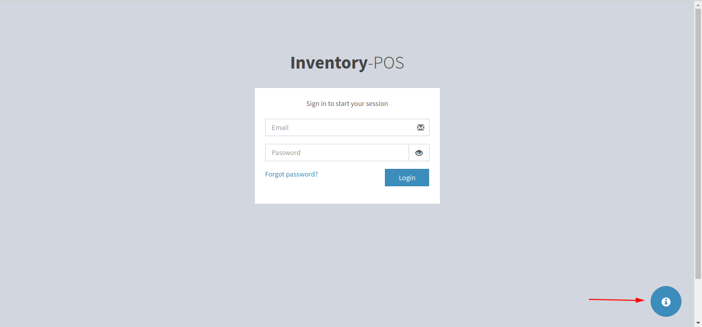

# Inventory POS

## Introduction
This is just a simple **Point of sale** webapp; it essentially keeps track of sales, purchases, and provides the users with reciept of purchases in addition to tabulating the graph of sales over desired period of time. 

## How to log-in 
By clicking on the *exclamation mark* on the *bottom right corner of the screen*, you'll be presented with a details for a dummy guest account. You can use these details to log in and access the full funcctionality of the app except the *registration* tab, which is only accessible through the *admin account*. 

## Technologies
1. AdminLTE 2.0 -- Bootstrap template used for entire website -- [adminlte.io](https://adminlte.io/themes/AdminLTE/index2.html)
2. fpdf -- for creating shopping receipt -- [fpdf.org](http://www.fpdf.org/)
3. jQuery -- [jQuery.com](https://jquery.com/)
4. sweetalertjs -- for creating beautiful pop-ups -- [sweetalert.js.org](https://sweetalert.js.org/) 
5. LAMP stack -- Linux + Apache + MySQL + PHP
6. HTML, CSS, Sass, and Javascript
7. DataTables [DataTables](https://datatables.net/)
8. Bootstrap-show-password [Password Toggler](https://github.com/wenzhixin/bootstrap-show-password)
